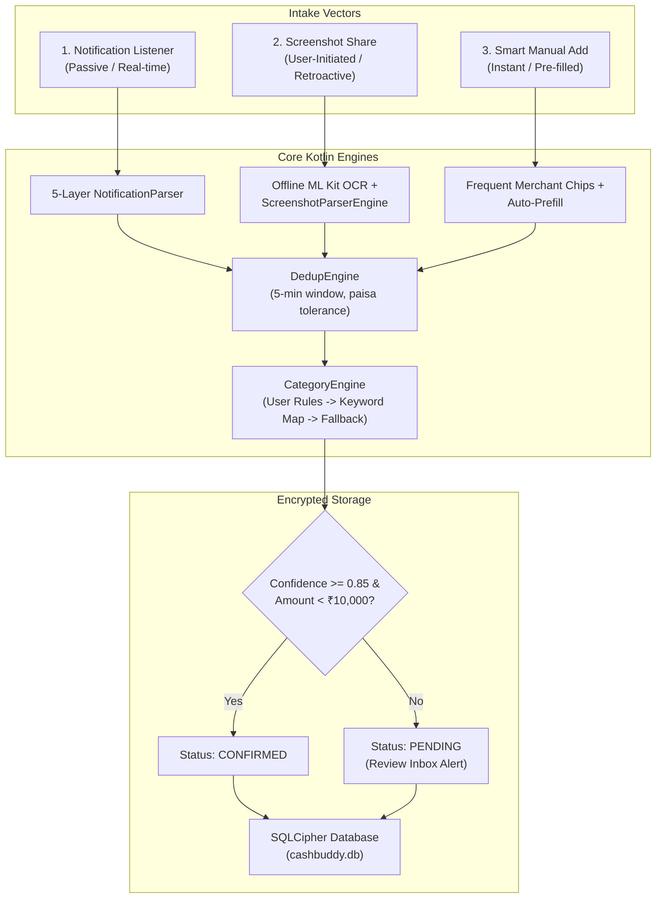
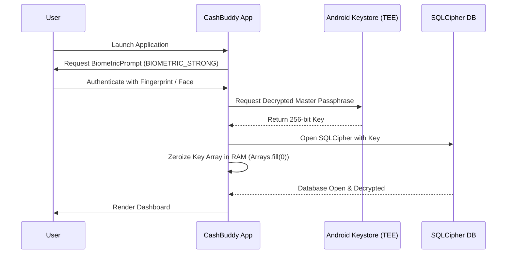

# CashBuddy — High-Level Architecture (HLD)

## 1. Executive Summary & Vision

**CashBuddy** is an intelligent, privacy-first, 100% offline personal finance tracking application built with a **Pure Kotlin Multiplatform (KMP)** core architecture. It automatically captures expenses, income, and account balances across Indian payment applications and banks through a robust three-layer capture system—completely offline with zero cloud dependency.

### Core Architectural Non-Negotiables:
1. **Zero SMS Permissions**: Complies strictly with Google Play Store policies. Uses Android's `NotificationListenerService` (`BIND_NOTIFICATION_LISTENER_SERVICE`) exclusively.
2. **Zero Network Permissions (100% Offline)**: No `android.permission.INTERNET` declared in production. All parsing, categorization, and data persistence occur entirely on-device.
3. **Pure Kotlin Multiplatform Core**: All parser engines, categorization logic, deduplication algorithms, and data repositories reside in `shared/commonMain` in pure Kotlin. Zero JNI overhead, zero NDK build dependencies, and zero `UnsatisfiedLinkError` native library loading crashes.
4. **Hardware-Backed AES-256 GCM Encryption**: All sensitive financial records at rest are secured via **SQLCipher (AES-256 GCM)**, keyed via the **Android Keystore (TEE / StrongBox)**.
5. **Human-in-the-Loop Review**: Transactions with confidence $< 0.85$ or amount $\ge ₹10,000$ (or user threshold) are preserved as `PENDING` for explicit confirmation in the Review Inbox.

---

## 2. System Architecture

```
┌─────────────────────────────────────────────────────────────────────────────┐
│                              PRESENTATION LAYER                             │
│                  (Compose Multiplatform 1.11+ • Material 3)                 │
│                                                                             │
│   HomeScreen      ReviewScreen      TransactionsScreen      StatsScreen     │
│   AddScreen       AccountsScreen    BudgetScreen            SettingsScreen  │
│                                                                             │
│      StateFlow<UiState> ◄─────────────────────────► UiIntent / Actions      │
│                            (MVI / MVVM Pattern)                             │
└─────────────────────────────────────┬───────────────────────────────────────┘
                                      │
                                      ▼
┌─────────────────────────────────────────────────────────────────────────────┐
│                              DOMAIN LAYER                                   │
│                       (shared/src/commonMain)                               │
│                                                                             │
│  Use Cases:                                                                 │
│  • CalculateBalanceUseCase          • ConfirmTransactionUseCase             │
│  • GetRecentTransactionsUseCase     • RejectTransactionUseCase              │
│  • GetUnreviewedCountUseCase        • ModifyTransactionUseCase              │
│  • GetMonthlySummaryUseCase         • ExportDataUseCase                     │
│  • GenerateCategoryBreakdownUseCase • BatchCategorizeUseCase                │
│                                                                             │
│  Domain Models: Transaction, Account, Category, Budget, Goal, MerchantRule  │
│  Repository Interfaces: TransactionRepository, CategoryRepository, etc.     │
└─────────────────────────────────────┬───────────────────────────────────────┘
                                      │
                                      ▼
┌─────────────────────────────────────────────────────────────────────────────┐
│                           CORE ENGINES & DATA LAYER                         │
│                       (shared/src/commonMain)                               │
│                                                                             │
│  ┌───────────────────────────────────────────────────────────────────────┐  │
│  │                          CORE ENGINES                                 │  │
│  │  • NotificationParser: 5-layer probabilistic intake engine             │  │
│  │  • ScreenshotParserEngine: Multi-app UPI OCR regex entity extractor   │  │
│  │  • CategoryEngine: 3-tier hybrid priority categorization engine       │  │
│  │  • DedupEngine: 5-minute window cross-channel duplicate detector      │  │
│  │  • FraudDetector: Velocity rate limiter & deduplication hashing       │  │
│  │  • ProbabilisticClassifier: Content-first Naive Bayes gating engine   │  │
│  └──────────────────────────────────┬────────────────────────────────────┘  │
│                                     │                                       │
│                                     ▼                                       │
│  ┌───────────────────────────────────────────────────────────────────────┐  │
│  │                     DATA ACCESS & STORAGE                             │  │
│  │  • Repositories: TransactionRepositoryImpl, CategoryRepositoryImpl... │  │
│  │  • Database: SQLDelight 2.0.2 with SQLCipher driver                   │  │
│  │  • Key Store: AndroidKeystoreManager (TEE/StrongBox AES-256-GCM)      │  │
│  └───────────────────────────────────────────────────────────────────────┘  │
└─────────────────────────────────────┬───────────────────────────────────────┘
                                      │
                                      ▼
┌─────────────────────────────────────────────────────────────────────────────┐
│                            PLATFORM LAYER                                   │
│                                                                             │
│  ┌─────────────────────────────────────┐  ┌──────────────────────────────┐  │
│  │            Android                  │  │             iOS              │  │
│  │ • TransactionNotificationListener   │  │ • LocalAuthentication        │  │
│  │ • ScreenshotHandler (ML Kit OCR)    │  │ • Keychain Key Storage       │  │
│  │ • AndroidDatabaseDriverFactory      │  │ • IosDatabaseDriverFactory   │  │
│  │ • BiometricPrompt & Keystore        │  │ • Share Extension Entry      │  │
│  └─────────────────────────────────────┘  └──────────────────────────────┘  │
└─────────────────────────────────────────────────────────────────────────────┘
```

---

## 3. The 3-Layer Transaction Capture Pipeline

CashBuddy solves the "missing transactions" problem common to finance apps by providing three complementary capture vectors:



### 1. Notification Listener (Primary Automated Channel)
- Listens to status bar broadcasts via `NotificationListenerService`.
- Filtered through a package allowlist of **50+ verified Indian banking and UPI apps**.
- Discards OTPs, promotional alerts, balance broadcasts, and cashbacks.
- Extracts amount, transaction type (debit/credit), merchant, and account last-4 digits.

### 2. Screenshot Sharing (High-Accuracy Visual Channel)
- Users share payment confirmation screens directly from Google Pay, PhonePe, Paytm, CRED, Amazon Pay, or transit apps (e.g. BMTC bus tickets).
- Processed 100% locally using bundled **Google ML Kit Text Recognition** (no network call, no cloud OCR).
- `ScreenshotParserEngine` extracts amounts (with or without currency prefixes), merchant names, transaction types, and UTR/UPI reference numbers.
- Navigates immediately to the Transactions screen and displays a Toast confirmation.

### 3. Smart Manual Entry (Zero-Friction Fallback)
- For cash expenses or unparsed transfers.
- Provides dynamic chips of the user's top-frequented merchants.
- Pre-fills category and account based on historical patterns.

---

## 4. On-Device Categorization: Hybrid Rules + Personalization

Categorization runs entirely on-device via a three-tier priority ladder in [`CategoryEngine.kt`](file:///c:/Users/ailik/AndroidStudioProjects/CashBuddy/shared/src/commonMain/kotlin/com/cashbuddy/core/CategoryEngine.kt):

| Tier | Source | Confidence | Description |
|---|---|---|---|
| **Tier 1** | **User-Learned Rules** | **1.0 (100%)** | When a user modifies a transaction's category, a custom rule is immediately persisted and stored in memory (`@Volatile` copy-on-write Map). Substring containment enables matching across variations. |
| **Tier 2** | **Curated Keyword Map** | **0.90 (90%)** | 300+ curated keywords covering India's primary merchants (Swiggy, Zomato, Uber, Ola, Blinkit, Zepto, D-Mart, Amazon, BESCOM, Airtel, Apollo, Zerodha, etc.). |
| **Tier 3** | **Fallback** | **0.50 (50%)** | Unknown transactions are assigned to `Unknown` / `Uncategorized`, forcing them into the Review Inbox for explicit user confirmation. |

---

## 5. Security & Privacy Architecture



1. **Database Encryption**: AES-256 GCM full-database encryption via SQLCipher.
2. **Key Storage**: Passphrases are generated using `SecureRandom` and protected via Android Keystore backed by hardware TEE (Trusted Execution Environment) or StrongBox keymaster.
3. **RAM Hygiene**: Passphrase byte arrays in memory are zeroized with `java.util.Arrays.fill(passphrase, 0.toByte())` immediately after the SQLCipher driver initializes.
4. **Window Protection**: Sensitive activities set `FLAG_SECURE` to prevent unauthorized screenshots or OS recents screen thumbnail caching.
5. **Session Lock**: The application automatically clears session state and requires biometric re-authentication after 5 minutes in the background.

---

## 6. Project Modules & Topology

```
CashBuddy/
├── androidApp/               # Android Application Module
│   ├── src/main/kotlin/      # MainActivity, NotificationListener, ScreenshotHandler
│   └── build.gradle.kts      # Dependencies: shared, Compose, ML Kit bundled OCR
├── shared/                   # Kotlin Multiplatform Shared Module
│   ├── src/commonMain/       # 100% Platform-Agnostic Code
│   │   ├── kotlin/com/cashbuddy/
│   │   │   ├── core/         # Core Engines: Parser, CategoryEngine, Dedup, Fraud
│   │   │   ├── data/         # Repositories, SQLDelight DB creation, Column Adapters
│   │   │   ├── di/           # Koin AppModule
│   │   │   ├── domain/       # UseCases, Domain Models, Repository Interfaces
│   │   │   └── presentation/ # Compose Multiplatform Screens, ViewModels, Theme
│   │   └── sqldelight/       # AppDatabase.sq schema, tables, and queries
│   ├── src/androidMain/      # Android Actual Implementations
│   │   └── kotlin/com/cashbuddy/
│   │       ├── data/local/   # AndroidDatabaseDriverFactory (SQLCipher + Keystore)
│   │       ├── di/           # AndroidModule (KeystoreManager, FileExporter)
│   │       └── security/     # AndroidKeystoreManager (TEE/StrongBox)
│   ├── src/iosMain/          # iOS Actual Implementations
│   │   └── kotlin/com/cashbuddy/data/local/IosDatabaseDriverFactory.kt
│   └── src/commonTest/       # Multiplatform Unit Test Suite
│       └── kotlin/com/cashbuddy/core/CoreEnginesTest.kt
└── iosApp/                   # Xcode project & SwiftUI entry point
```
