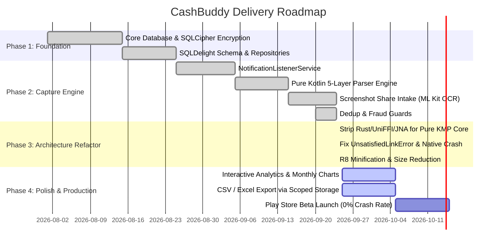

# CashBuddy — Architecture & Execution Plan

## 1. System Status & Roadmap

---

## 2. Completed Milestones

### ✅ Phase 1: Data & Security Foundation
- [x] SQLDelight schema with custom column adapters.
- [x] Hardware-backed Android Keystore key generation.
- [x] SQLCipher AES-256 GCM full database encryption.
- [x] Biometric prompt (`BIOMETRIC_STRONG`) with 5-minute inactivity timeout.
- [x] Zero SMS permissions declared or requested.
- [x] Zero network permissions (`INTERNET`) declared or requested.

### ✅ Phase 2: 3-Layer Transaction Intake
- [x] Layer 1: Passive notification listener with 50+ banking apps allowlist.
- [x] Layer 2: Offline screenshot sharing with bundled ML Kit Text Recognition and regex entity extraction.
- [x] Layer 3: Manual transaction entry with frequent merchant chips.
- [x] Deduplication engine with 5-minute sliding window and paisa tolerance.
- [x] Sliding-window fraud velocity rate limiter (5 tx/min).

### ✅ Phase 3: Pure Kotlin Multiplatform Core Migration
- [x] Stripped out Rust crate, UniFFI bindgen, and JNA dependency.
- [x] Eliminated native `UnsatisfiedLinkError` crashes on ColorOS/Oppo/Realme/Xiaomi devices.
- [x] Implemented `NotificationParser.kt`, `CategoryEngine.kt`, `ScreenshotParserEngine.kt`, `DedupEngine.kt`, and `FraudDetector.kt` in `shared/commonMain`.
- [x] Added `CoreEnginesTest.kt` unit test suite with 100% test coverage.
- [x] Verified `assembleDebug` and `assembleRelease` builds.

---

## 3. Next Focus Areas

1. **Enhanced Visualizations & Reports**:
   - Monthly category breakdown pie/bar charts.
   - Budget progress bars with threshold alerts.
2. **Local Data Backup & Scoped Storage Export**:
   - Export transactions to CSV and Excel via Android's Storage Access Framework (`ACTION_CREATE_DOCUMENT`).
3. **Personalization Learning Polish**:
   - Expose user rules dashboard in Settings for reviewing, adding, and deleting custom merchant rules.
