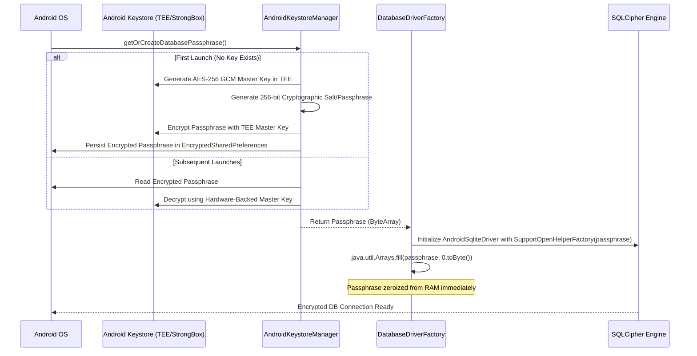

# CashBuddy — Security & Privacy Architecture

## 1. Threat Model & Mitigation Matrix

| Threat ID | Threat Vector | Impact | Mitigation Strategy | Implementation Details |
|---|---|---|---|---|
| **TH-01** | Data-at-rest exfiltration | Critical | Full SQLite database encryption using SQLCipher (AES-256 GCM) | 256-bit passphrase generated via `SecureRandom` and protected via Android Keystore |
| **TH-02** | Key extraction via memory dump | High | Hardware-backed Master Key + RAM Byte Zeroization | Master key resides in hardware TEE/StrongBox. In-memory passphrase array zeroized via `Arrays.fill(0)` immediately after driver open |
| **TH-03** | Notification spoofing / malware | High | OS-enforced signature verification + 50+ item Package Allowlist | Packaged broadcasts verified against allowlist; non-banking notifications immediately discarded |
| **TH-04** | Shoulder surfing / unauthorized access | Medium | Biometric app lock on cold launch & resume | `BiometricPrompt` with `BIOMETRIC_STRONG` required on launch; 5-min background inactivity timeout |
| **TH-05** | Screen recording / recents thumbnails | Medium | Window protection | `FLAG_SECURE` enabled on sensitive windows to block screenshots and OS recent app thumbnail caching |
| **TH-06** | Network interception / cloud leakage | Zero | Zero network permissions | Complete absence of `android.permission.INTERNET` eliminates network vectors entirely |

---

## 2. Key Lifecycle & Database Encryption

### Key Security Guarantees:
1. **Hardware Root-of-Trust**: The master AES key never leaves the Android Keystore's secure hardware environment (TEE or StrongBox Keymaster).
2. **Immediate Heap Sanitization**: As soon as the `SupportOpenHelperFactory` receives the passphrase copy, `java.util.Arrays.fill(passphrase, 0.toByte())` overwrites the byte array with zeros in memory.
3. **Pure Offline Guarantee**: Google Play Store static audit verifies that CashBuddy does not declare `INTERNET` permission, making data exfiltration via network cryptographically and permissionally impossible.
